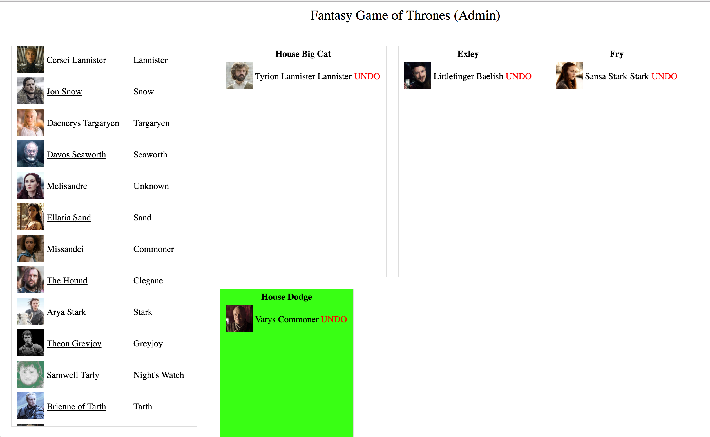

# fantasy-got
fantasy game of thrones drafting setInterval

## what

hosts a snake draft of GoT characters with one admin who can assign chars to teams.

it looks like this:



## how

need: python 3, pip, yarn

```
pip install -r requirements.txt

# populate your teams.txt file with team names, one per line

# build the UI
cd ui
yarn build

# run flask (debug, local machine only)
export FLASK_APP=app.py
python -m flask run

# OR run flask visible on 0.0.0.0
python app.py
```

all state lives in the `state.pickle` file, delete it if you mess things up.
